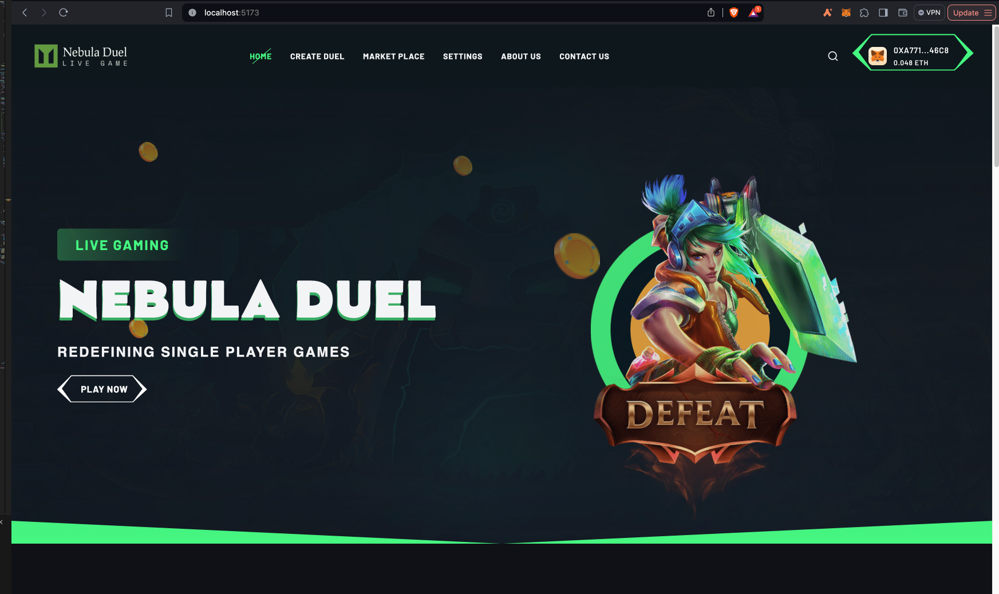
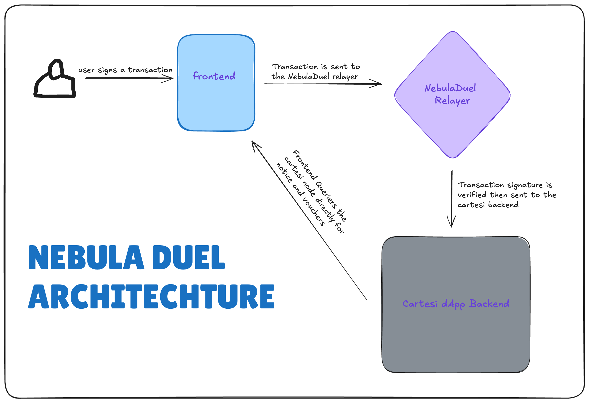
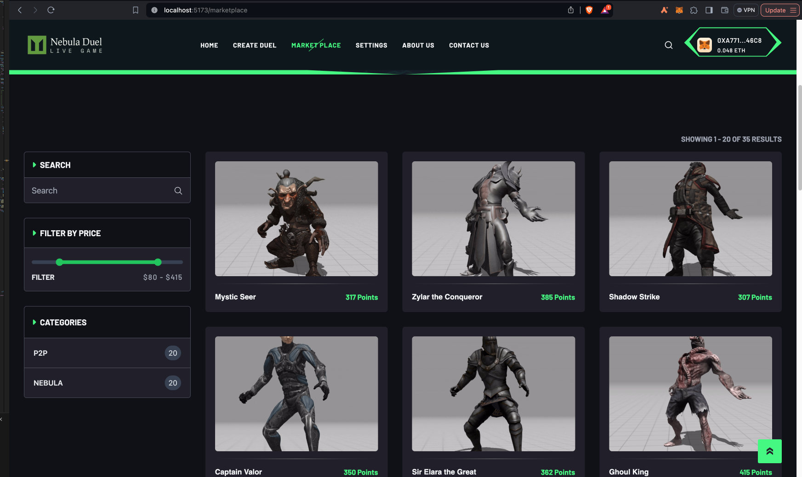
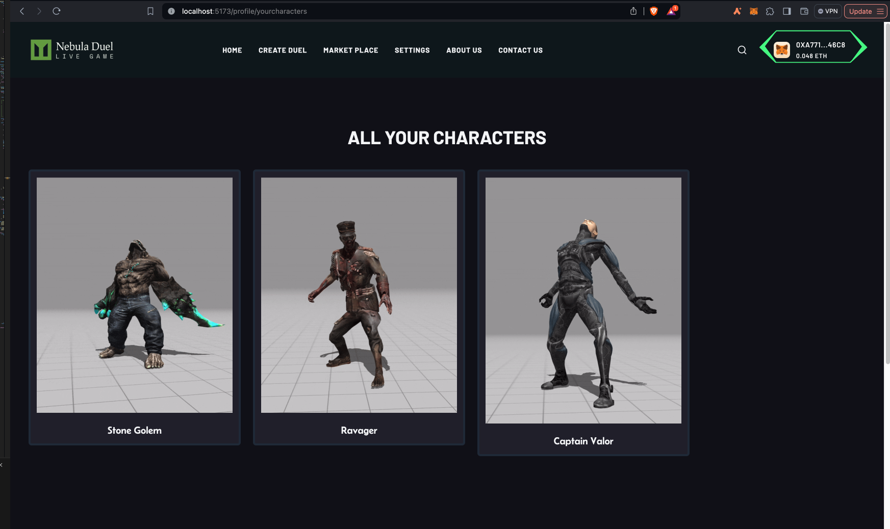
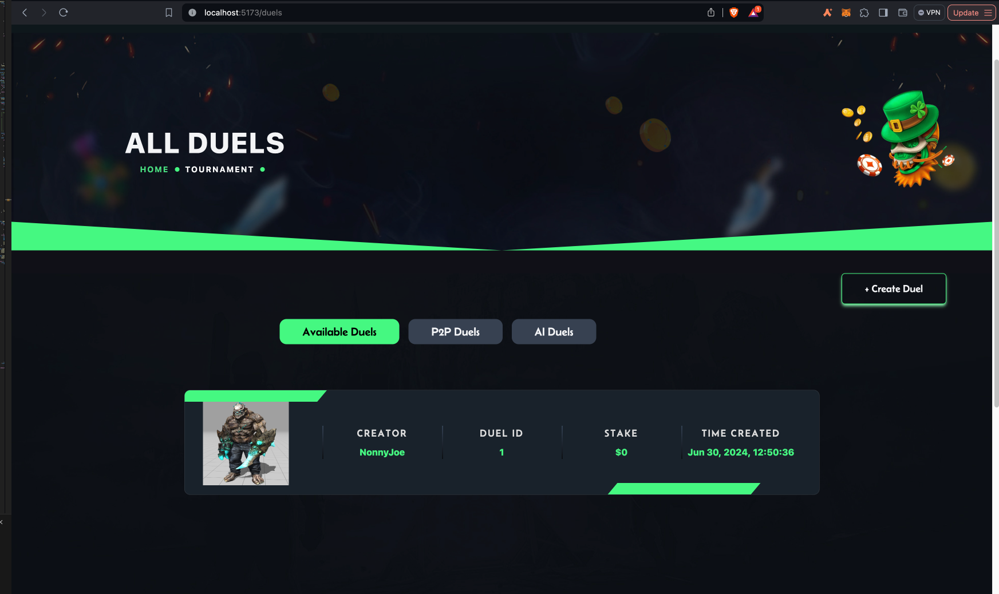
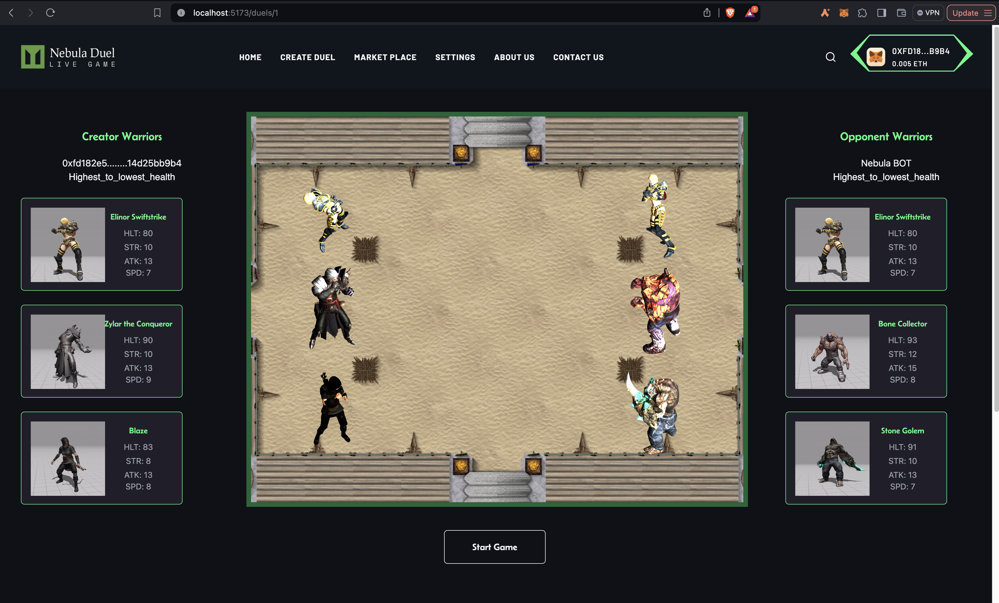

# NEBULA DUEL

... zero player game built on Cartesi.



Nebula duel is built for persons that love the thrills and entertainment of the gaming world. Players get to purchase their favorite warriors, create duels or join already created ones. At the end of each duel, only one winner emerges.

<br/>
<br/>

## DEMO VIDEO

[DEMO VIDEO ON YOUTUBE ](https://youtu.be/_3c-XJvmBMo)

<br/>
<br/>

## COMPONENTS OF NEBULADUEL

#### - Backend bulit with rust and deployed on Cartesi (Base network).

#### - Frontend Built with react and a complex integration with 3d models.

#### - Relayer built with nodejs and ethers.



<br/>
<br/>

## User interaction flow:

- Users basically interact with the frontend by signing a transaction with their wallets. they only need to sign this transactions hence they do not pay gas fees for that.
- Their signed transactions are sent to out backend which verifies the signatures then relays these transactions to out smart contract on BASE Sepolia (Input box contract).
- Information relayed to our dapp is picked up by the Cartesi Node and sent to out logic implementation on cartesi where teh execution is carried out before being sent back to the Base.
- Information on out frontend are picked up from our subgraph made available by cartesi.



<br/>
<br/>

# How to get started

## Create profile

Players can create profiles seamlessly on the platform simply by connecting a wallet and then navigating to the `profile` page and passing in: <br/>
i. Name ( can be nickname ) <br/>
ii. Preferred avatar

Note that this process requires the player to sign a transaction, so wait for wallet to pop up, then sign and wait for the transaction to be completed on-chain. <br/>
Upon a successful registration, 1050 points are minted to each player for use to purchase his/her preferred warriors.
<br/>
<br/>

## Buy warriors

Every player needs at least three warriors for the duels. Warriors are player characters with various attributes and qualities that are used for engaging in duels.
Every warrior has attributes: health, strength and attack in different degrees. The cost for each warrior is a reflection of the attributes it possesses.

To purchase a warrior, go to your profile page, select the preferred warriors and then buy. **NOTE** Every player gets free 1050 points after profile creation to purchase characters, and when the 1050 points are exhausted the player can buy more points using the $nebular token.
<br/>
<br/>

## Create duel

Players can create new duel or join already created duels. To create a new duel:

i. Go to the homepage, click on PLAY NOW <br/>
ii. From the modal that'll pop up, select `create duel`. <br/>
iii. Select your warriors, sign the transaction and continue.

<br/>
<br/>

## Join duel

i. Click on PLAY NOW <br/>
ii. Click on `join duel`. <br/>
iii. Select your warriors, select a strategy, sign the transaction and continue.

<br/>

When in the duel arena, click on `start` button for the duel to begin.
<br/>
<br/>
At the end of each duel, one player wins. The winning characters add to their experience and points, and the higher the points the more valuable the characters are. Such valuable characters can be sold for $nebular token on the platform (the marketplace will be implemented in the v2). The $nebular token is an ERC20 token with real value.

<br/>
<br/>

### Developers

Bugs reports and suggestions:
If you discover a bug or would like to suggest a feature, please open an issue in the repository.

<br>
<br>

# Project Setup and Running Guide

This guide provides instructions for setting up and running the backend, relayer, frontend, and Nebula contract of the project locally.

## Table of Contents

- [Running the Backend](#running-the-backend)
- [Running the Relayer](#running-the-relayer)
- [Running the Frontend](#running-the-frontend)
- [Running the Nebula Contract](#running-the-nebula-contract)

## Running the Backend

1. **Navigate to the App Folder**

   - Open your terminal and `cd` into the `app` folder.

2. **Configure the Storage Implementation**

   - Navigate to `src/storage/mod/`.
   - In the new function of the Storage Implementation, change the `relayer_addr` variable to the wallet address your relayer will use to send transactions to the backend.
   - Copy the private key for this address for use in the next section.

3. **Build and Run the Application**

   - Run the following commands:
     ```bash
     cartesi build
     cartesi run
     ```

## Running the Relayer

1. **Navigate to the Relayer Folder**

   - `cd` into the `relayer` folder.

2. **Install Dependencies**

   - Run the following command:

     ```bash
     npm install
     ```

3. **Set Up Environment Variables**

   - Create a `.env` file with the following details:

     ```
     PRIVATE_KEY=<your_private_key>
     INPUTBOX_ADDRESS=<input_box_address>
     RPC_URL=<rpc_url>
     DAPP_ADDRESS=<dapp_address>
     ```

   - **Note:** The `PRIVATE_KEY` should be the private key copied from the backend setup.

4. **Start the Relayer Backend**

   - Run the following command:

     ```bash
     npm run watch
     ```

## Running the Frontend

1. **Navigate to the Frontend Folder**

   - Exit the `relayer` folder and `cd` into the `frontend` folder.

2. **Install Dependencies**

   - Run the following command:

     ```bash
     npm install
     ```

3. **Set Up Environment Variables**

   - Create a `.env.local` file with the following details:

     ```
     VITE_PINATA_API_KEY=98c7260dbce5e3062dee
     VITE_PINATA_SECRET_API_KEY=06effff539f4f5c2be1780bdbc57d97b72306ba931ec29cd8a9468ce2b1e6386
     ```

4. **Update Configuration Files**

   - Navigate to `src/utils` and open `relayTransaction.tsx`.
     - Change the URL link in the `sendTransaction` function (line 61) to `http://localhost:3000/transactions`.
   - Open `readState.tsx` in the same folder.

     - Replace the `const response` in lines 7-8 with:

       ```javascript
       const response = await axios.get(
         `http://localhost:8080/inspect/${data}`,
         {
           headers: { "Content-Type": "application/json" },
         }
       );
       ```

   - Open `readSubgraph.tsx` in the same folder.

     - Replace the `const url` of the `fetchNotice` function with:

       ```javascript
       const url = "http://localhost:8080/graphql";
       ```

5. **Start the Frontend**

   - Run the following command:

     ```bash
     npm run dev
     ```

## Running the Nebula Contract

1. **Navigate to the Dynamic_NFT Folder**

   - `cd` into the `Dynamic_NFT` folder.

2. **Install Dependencies**

   - Run the following command:

     ```bash
     npm install
     ```

3. **Set Up Environment Variables**

   - Create a `.env` file with the following details:

     ```
     BASE_SEPOLIA_PRIVATE_KEY=<your_base_sepolia_private_key>
     BASE_SEPOLIA_API_KEY=<your_base_sepolia_api_key>
     BASESCAN_API_KEY=<your_basescan_api_key>
     ```

4. **Deploy Locally**

   - Start a local node by running:

     ```bash
     npx hardhat node --network local-tableland
     ```

   - Deploy the contract locally and run the scripts:

     ```bash
     npx hardhat run scripts/newdeploy.ts --network localhost
     ```

   - You should get an output similar to:

     ```
     https://testnets.tableland.network/api/v1/query?statement=SELECT%20*%20FROM%20NebulaNFT_84532_52
     ```

     Copy and paste this URL into your browser.

5. **Deploy to a Live Network**

   - Ensure the necessary `.env` requirements are provided for the specific network.
   - Deploy the contract to a live network (e.g., base-sepolia) by running:

     ```bash
     npx hardhat run scripts/newdeploy.ts --network base-sepolia
     ```

<br>
<br>

## OTHER IMAGES

### PURCHASE CHARACTERS


### CREATE DUELS



### VIEW AVAILABLE DUELS



### BATTLE


