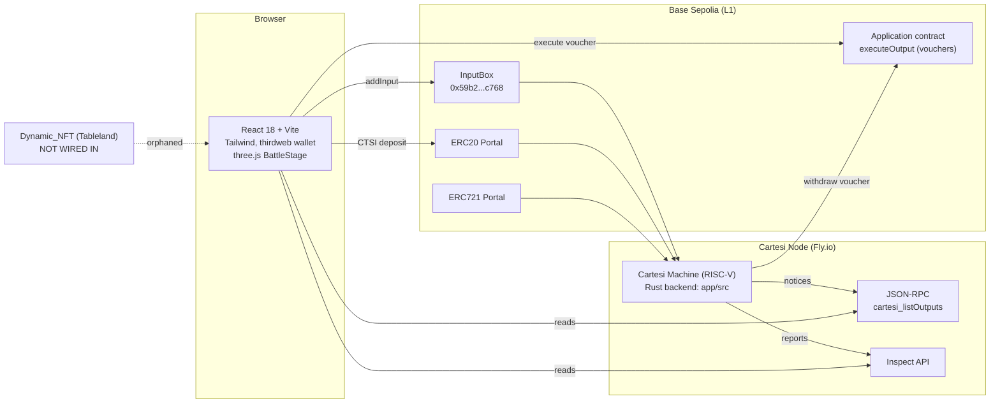

# Nebula Duel — Comprehensive Product & Technical Audit

> Full-stack review covering game design, player experience, frontend, Cartesi integration, security, and product readiness. All findings are evidence-based with file references.

---

## 1. Executive Summary

Nebula Duel is an auto-battler dueling game running entirely inside a Cartesi Rollups v2 machine (Rust backend), with a React/three.js frontend on Base Sepolia. Players create a profile, get 1050 free points, buy 3-warrior squads from a 20-character catalog, and fight in three modes: **P2P duels** (with optional CTSI staking), **AI duels**, and a surprisingly deep **20-level PvE campaign** with elements, powers, and a charm system.

The backend is the strongest part of the project: ~30 advance handlers, 16 inspect routes, real ERC-20 portal deposits and voucher-based withdrawals, all on the current v2 stack. The campaign module in particular is genuinely well-built.

The project's biggest problems are not missing features — they are **trust-breaking inconsistencies**: the README describes features ($nebular token, signature verification, NFT marketplace) that do not exist in the code; combat is fully deterministic with strategies publicly readable, making staked duels exploitable; admin "profit withdrawal" doesn't emit vouchers (funds can't actually leave); there is **not a single automated test** in the entire repository; and live Pinata API keys are committed in the README.

**Overall: a feature-rich, ambitious prototype at roughly 65–70% of a launchable product**, held back by fairness exploits, doc/code drift, and zero test coverage.

---

## 2. Architecture Overview

| Layer | Reality |
|---|---|
| Frontend | React 18, Vite, Tailwind 3.4, react-router 6, **thirdweb** wallet + ethers 5, three.js/@react-three/fiber for battles, sonner toasts. Context-only state (`zustand` installed but never imported). |
| Backend | Pure Rust, no framework, v2 finish loop in `app/src/main.rs`, in-memory `Storage` struct (no DB — correct for Cartesi). |
| Cartesi | Rollups **v2** (machine-guest-tools 0.17.2, `rollup-init`, v2 vouchers with `value`, `executeOutput`). Self-hosted node on Fly.io, Base Sepolia (chain 84532). |
| Smart contracts | `Dynamic_NFT/contracts/Nebula.sol` — UUPS ERC-721 with Tableland metadata. **Zero references from game code. Orphaned.** |
| Transaction model | Frontend calls `InputBox.addInput` directly; users pay gas for every action. |
| Indexing | No subgraph. Frontend reads notices via `cartesi_listOutputs` JSON-RPC and inspect reports. `readSubgraph.tsx` is a misleading legacy filename. |

---

## 3. Feature Inventory

| Feature | Status | Description | Completeness |
|---|---|---|---|
| Wallet connection | Fully Implemented | thirdweb ConnectButton, chain switch preflight | 90% |
| Profile creation | Fully Implemented | Name + Pinata avatar upload, 1050 free points | 90% |
| Starter team purchase | Fully Implemented | One-time 3-character team with points | 90% |
| Single character mint | Fully Implemented | Points (with +15%/mint premium, 6h cooldown) or CTSI | 90% |
| P2P duel create/join | Fully Implemented | Open lobby, self-join blocked, optional CTSI stake | 85% |
| Strategy selection | Fully Implemented | 4 targeting strategies; auto-fight when both set | 85% |
| Battle execution | Fully Implemented | Deterministic round-based auto-battle, 500-round cap | 85% |
| 3D battle replay | Fully Implemented | GLTF models, attack/hit/death anims, damage floats, synthesized audio. All 27 model files present and git-tracked | 80% |
| AI duels | Partially Implemented | Easy/Hard PvE works, but `total_ai_battles`/won/lost counters are **never updated** | 70% |
| Campaign (20 levels) | Fully Implemented | Elements, biomes, 13 power effects, energy, retry costs, replay-reward decay, permanent stat boosts | 90% |
| Charms system | Fully Implemented | 11 charm types, points or CTSI, max 5 each | 85% |
| Marketplace (characters) | Fully Implemented | List/delist/reprice/buy in CTSI, 3% configurable fee | 85% |
| CTSI deposit | Fully Implemented | v2 ERC20Portal parsing | 85% |
| CTSI withdrawal | Fully Implemented | Voucher emission + frontend `executeOutput` UI | 85% |
| Duel staking/settlement | Partially Implemented | Winner gets 90% of pot in **internal balance**; exploitable (see §7) | 60% |
| NFT bridge (character ↔ ERC-721) | Broken | Withdraw sets `owner="0xOffChain"` but emits **no mint voucher**; deposit only re-assigns pre-existing characters; contract not wired | 25% |
| $nebular token | Missing | `nebula_token_balance` initialized to 0 and never mutated. Pure README fiction | 5% |
| Campaign leaderboard | Fully Implemented | Top 50 via inspect, AI excluded | 85% |
| Global P2P leaderboard | Missing | Homepage "Top Gamers" is a static marketing carousel | 0% |
| Game history / profile stats | Partially Implemented | Win/loss counters exist but `register_win` increments the player's **entire roster**, not the 3 fighters | 40% |
| Notifications | Missing | Toasts only | 0% |
| Spectator / chat / tournaments | Missing | — | 0% |
| Admin functions | Partially Implemented | Properly gated, but profit "withdrawals" only decrement counters — no vouchers, treasury is unreachable on-chain | 50% |
| Onboarding/tutorial | Missing | README is the only tutorial, and it's outdated | 0% |
| Tests | Missing | Zero tests in Rust, frontend; stale Tableland tutorial test in Dynamic_NFT tests a different contract | 0% |

---

## 4. Game Design Review

**What's good.** The strategy-then-autobattle format is a legitimate genre (think auto-chess lite) and well-suited to Cartesi: one input per decision, deterministic verifiable resolution. The campaign is the design highlight — elemental matchups, biome modifiers, charm loadouts, retry costs, decaying replay rewards, and permanent squad upgrades create a real progression loop. Character pricing reflecting stats, mint premiums, and cooldowns show genuine economy-design thinking.

**What's broken at the design level:**

1. **P2P combat has zero randomness and only 4 strategies.** Damage is `max(1, strength + attack/2 − speed/4)` with no variance and super powers unused outside the campaign. Given two squads and two strategies, the outcome is a pure function — there are only 16 possible matchup outcomes per squad pairing.
2. **Strategies are public before resolution.** The duel JSON (`app/src/structures.rs:197,227`) serializes both strategies, readable via `duels/<id>` inspect. A joiner can read the creator's committed strategy, simulate all 4 counters off-chain, and **only join staked duels they're guaranteed to win**. This breaks competitive integrity completely.
3. **No reward loop for the core mode.** P2P and AI wins award **zero points** — only campaign pays. The mode the game is named after has no progression incentive unless you stake real tokens (which is exploitable, per above).
4. **Roster-wide win crediting** (`players_profile/mod.rs:79–100`) inflates the experience of warriors that never fought, undermining the "valuable veteran characters" premise.
5. **First-attacker advantage:** the creator's side always attacks first each round, a meaningful edge in a deterministic game.

**Replayability:** Campaign — good. P2P — poor until randomness, hidden strategies, and rewards exist. Skill expression is currently "squad-stat shopping," not in-match decisions.

---

## 5. Player Experience Review

**First impression:** Attractive dark sci-fi homepage with a clear "Play Now" CTA that smartly branches on wallet/profile/roster state. But the page also shows fake "Creators" NFT cards and a "Top Gamers" section with outdated marketing copy — a sophisticated visitor will notice.

**Onboarding:** None in-app. The funnel is long: connect wallet → switch to Base Sepolia → acquire testnet ETH (unexplained) → sign profile tx → wait for L1 confirmation + Cartesi processing → buy team → create duel → **wait for a human opponent** → pick strategy → fight. That's 4–5 paid L1 transactions and multiple multi-second waits before first gameplay. The AI duel and campaign modes are the natural new-player path but nothing routes players there first.

**Learning curve: Medium-Hard** — not because the game is deep, but because nothing explains what strategies do, what stats mean in the damage formula, why you're waiting, or what gas is for.

**Top abandonment points:**

1. Gas requirement with no faucet link or explanation.
2. Empty duel lobby — no opponents means no P2P game; lobby doesn't even auto-refresh (fetch on mount only).
3. Post-transaction dead air: `waitForInputProcessed` polls up to 60s; strategy page polls 3s × 6 then gives up.
4. `/arena` route renders the Arena with no `duelId` — broken page reachable by URL.
5. Profile "update" reuses the create flow with unclear semantics.

---

## 6. Frontend Review

**UI quality:** Cohesive theme, reusable design tokens in `index.css`, consistent newer components (`PageHero`, `StatBars`, `WarriorPickCard`). Responsive Tailwind throughout with a mobile drawer nav. Genuinely above-average visual quality.

**UX gaps:** Header search box has no handler (`Header.tsx:205`). Contact form button is `type="button"` with no submit. Two marketplaces coexist — the real one at `/marketplace` and static mock product pages (Nintendo Switch!) at `/marketplace/:id`. Accessibility is thin: empty `alt` attributes, sparse aria labels, an emoji mute button.

**Game feel — what makes it feel good:** The `BattleStage` 3D engine is the standout: characters run to targets, play attack/hit/death animations, floating damage numbers, screen shake, biome-specific synthesized music and hit/crit/KO stingers via Web Audio (no audio files needed — clever), a skip button, and victory/defeat stingers. This is real "juice" most blockchain games never attempt.

**What prevents polish:** Everything around the battle is static and slow — no optimistic UI, no lobby auto-refresh, no transition between "transaction sent" and "battle ready" except spinners; 50+ `console.log`s; ~550 lines of commented-out old arena code shipped in `arena/dummy.tsx`; an unawaited `delay(4000)` in `ChooseStrategy.tsx:89` (a real bug — the wait silently does nothing); `navigate()` called during render in `JoinDuel.tsx:142` and `SelectWarriors.tsx:173`; `shuffleArray()` in render causing list reordering on every render.

**State management:** Context + fetch-on-mount with three inconsistent read sources (inspect, notices via JSON-RPC, context cache). `ProfileContext` localStorage persistence is half-disabled, and `ConnectButton` skips re-syncing a profile once the wallet matches — stale profile data after on-chain updates is guaranteed.

---

## 7. Cartesi & Blockchain Review

**Integration quality: good and current.** This is a real v2 app: correct finish loop, v1/v2 timestamp compat (`main.rs:39–49`), v2 portal payload parsing, v2 vouchers with `value`, frontend execution via `Application.executeOutput`. Deposits and withdrawals work end-to-end. Identity correctly derives from `metadata.msg_sender` — players cannot impersonate each other.

**Security and trust findings, ranked:**

1. **Strategy front-running (Critical, fairness).** Deterministic combat + publicly inspectable committed strategies = guaranteed-win sniping of staked duels. Needs commit-reveal (submit `hash(strategy ‖ salt)`, reveal after both commit) or backend-side strategy hiding in duel serialization until both are set.
2. **Admin treasury is fake (Critical, trust).** `withdraw_profit_from_*` decrement counters without emitting vouchers — staking rake and fees accumulate inside the machine and can never reach L1. Either fix or stop collecting fees.
3. **README/code drift (Critical, trust).** "$nebular has real value" — dead field; the documented NFT marketplace doesn't exist. Claims contradicted by the code are worse than absent features for a judge or investor.
4. **`handle_fight` lacks participant authorization** (`advance_router.rs:417–449`) — any address can trigger resolution of someone else's ready duel. Low direct harm (outcome is deterministic) but wrong.
5. **Address-book mismatch (deploy-breaking).** Backend hardcodes local-Anvil portal addresses (`storage/mod.rs:104–108`) while `fly.toml` targets Base Sepolia. **Deposits on the production deployment will be silently ignored** because `msg_sender` won't match the hardcoded portal.
6. **Float-typed money.** All CTSI balances are `f64` with truncation on withdraw (`market_place/mod.rs:352`) and no decimal normalization on deposit. Use integer wei.
7. **No duel-lock on characters** — the same character can fight in multiple concurrent duels and be listed for sale mid-duel.
8. **Committed secrets:** live Pinata key+secret in `README.md:186–187`, an NFT.Storage JWT in `upload.mjs`, thirdweb client ID hardcoded.

**Randomness:** P2P has none. Campaign/AI use an LCG seeded by `block_timestamp + level_id·7919 + attempt_no·104729` — deterministic and replay-safe, mildly timestamp-influenceable, acceptable for PvE.

**Blockchain UX pain:** every action is an L1 transaction (sign → confirm → node-processing poll), with no batching and no explanation of the waits.

---

## 8. Technical Review

**Backend (Rust):** Well-modularized by domain; handlers return `Result` instead of panicking (a deliberate, documented cleanup — good); saturating arithmetic and round caps prevent infinite loops. Concerns: 8+ `.expect()` calls in output serialization (`structures.rs`) that could halt the machine; `?` on parse errors in the main loop (`main.rs:196,205`) can kill the process; hand-rolled `TcpStream` HTTP client for outputs; dead code (`who_plays_first`, `nebula_token_*`); transactions counted even when handlers fail; duplicate `structure_notice` definitions.

**Frontend (TS):** Works, but oversized components (BattleStage ~900 lines, userActivity ~735), warrior-selection UI tripled across pages, widespread `any` with eslint disabled, dead components (`GameArena`, `DuelCard1`, `Container`, `ProductList`), unused dependencies (`@apollo/client`, `graphql`, `zustand`, `nft.storage`, `wow.js`, `@cartesi/rollups`), nine `vite.config.ts.timestamp-*.mjs` artifacts polluting the repo status.

**Contracts:** `Nebula.sol` is reasonable UUPS/Tableland code with proper access control on `entrypoint`, but four conflicting deployment addresses exist across `status.json`, `hardhat.config.ts`, the README, and `.openzeppelin/` (which is for Ethereum Sepolia, not Base), and the test file tests a tutorial contract.

**Testing: zero across all three codebases.** For a game whose selling point is verifiable deterministic computation, the battle engine having no tests is the single biggest engineering gap — battle resolution, the damage formula, the campaign sim, and the economy math are all pure functions that are trivially unit-testable.

---

## 9. Product Readiness Scorecard

| Dimension | Score | Justification |
|---|---|---|
| Gameplay | 5/10 | Campaign is genuinely good; P2P core is deterministic, shallow (4 strategies), and rewardless |
| UX | 5/10 | Polished shell and battle juice; no onboarding, slow tx loops, stale-state bugs, broken routes |
| Technical quality | 5/10 | Current v2 stack and working money rails; zero tests, float money, dead code, machine-halting `.expect()`s |
| Trust & fairness | 3/10 | Strategy front-running on staked duels, fake treasury withdrawal, README claims contradicted by code, committed secrets |
| Retention | 3/10 | Campaign progression only; no P2P rewards, leaderboard, history, or notifications |
| Monetization | 4/10 | Fee/rake mechanics designed and implemented — but fees are uncollectable and $nebular doesn't exist |
| Competitive advantage | 6/10 | Verifiable on-chain auto-battler with real 3D presentation is a defensible niche; execution gap is the risk |

---

## 10. Priority Roadmap

### Critical — must fix before any launch

| Item | Impact | Effort | Risk if ignored |
|---|---|---|---|
| Hide/commit-reveal strategies in duel serialization & inspect | Restores P2P fairness | Medium (backend serialization change is small; full commit-reveal is moderate) | Staked duels are free money for attackers |
| Rotate & purge Pinata/NFT.Storage secrets from README and `upload.mjs` | Prevents account abuse | Trivial | Keys are public now |
| Fix portal address book for Base Sepolia (make addresses env-configurable) | Deposits work in production | Small | On-chain deposits silently lost |
| Emit vouchers from admin profit withdrawals (or remove fee collection) | Real treasury, honest economics | Small (the voucher emitter already exists) | Locked funds, trust damage |
| Rewrite README to match the actual architecture | Judge/investor credibility | Small | Every false claim is discoverable in 10 minutes |

### High priority

- Add P2P/AI win rewards (points + per-fighter-only experience) — fixes the empty core loop. Impact: high; effort: small.
- Unit tests for battle resolution, campaign sim, and economy math (pure functions, easy wins). Impact: high; effort: medium.
- Participant check on `fight`; duel-lock characters; integer wei balances. Effort: small each.
- Lobby polling/refresh + an opponent-joined signal; fix the unawaited `delay(4000)`.
- Route new players to AI duel/campaign first; add a faucet link and a "why am I waiting" explainer.

### Medium priority

- Global P2P leaderboard (data largely exists; needs an inspect route + page).
- Consolidate the three read paths behind one data layer (e.g., TanStack Query) and fix `ProfileContext` staleness.
- Remove dead code, mock marketplace pages, fake homepage NFT cards, unused deps, console.logs, vite timestamp files (add to `.gitignore`).
- Either wire the Tableland NFT loop end-to-end (mint voucher on withdraw) or cut the feature for v1.

### Nice to have

- Combat variance (small RNG damage range from the input hash), more strategies, in-match decisions.
- Match history page, replay sharing (battle logs already support it), notifications, tournaments.

---

## 11. Quick Wins

1. Award points for P2P/AI wins — one constant in `battle_challenge`.
2. Stop serializing strategies for unresolved duels — a few lines in `structures.rs`.
3. `git rm` the vite timestamp files; ignore them.
4. Fix `await delay(4000)` in `ChooseStrategy.tsx:89`.
5. Add participant check to `handle_fight`.
6. Link a Base Sepolia faucet in the connect flow.
7. Replace the homepage "Top Gamers" marketing fiction with the real campaign leaderboard data already served.
8. Delete `arena/dummy.tsx` and the mock product pages.

---

## 12. Long-Term Opportunities

- **Provable fairness as the brand:** deterministic Cartesi battles + published battle logs means every match is independently verifiable — lean into "the auto-battler that can't cheat you" once commit-reveal lands.
- Real $nebular tokenomics with on-chain settlement of marketplace trades.
- The NFT bridge done properly (voucher-minted Tableland characters) enables cross-game/portfolio value, which the README already promises.
- Tournaments with staked prize pools — the staking rails and rake logic mostly exist.

---

## 13. Final Verdict

**What's already impressive:** the breadth of a complete game economy (catalog, mint premiums, cooldowns, marketplace, charms, staking) running verifiably inside a Cartesi v2 machine; the 20-level campaign's depth; a 3D battle replay engine with synthesized audio that most web3 games never ship; working end-to-end CTSI deposit → play → voucher withdrawal.

**What's missing:** any reward for the core P2P mode, the $nebular token, the NFT loop, leaderboards/history, onboarding, and every single test.

**What prevents launch today:** four things — staked duels are exploitable via public strategies; production deposits would fail due to hardcoded local portal addresses; collected fees are unwithdrawable; and live API secrets sit in the README.

**Highest-ROI improvements:** strategy hiding (small backend change, fixes the worst exploit), P2P win rewards (one constant, fixes the core loop), env-driven contract addresses (makes production work), and an honest README (free credibility).

**Distance to production quality:** the foundation is real and the hard parts (Cartesi v2 integration, deterministic engine, money rails, 3D presentation) are done. With roughly 2–4 focused weeks on the critical and high-priority lists, this goes from "impressive demo with disqualifying flaws" to a genuinely launchable testnet game. As it stands today, it's about **65% of the way there** — a strong skeleton wearing marketing claims it can't yet back up.

---

# Addendum — Second Reviewer Assessment (Claude, Cowork session)

> Independent review by the agent that implemented the campaign/charms/marketplace/BattleStage systems. Largely concurs with the audit above; adds retention-focused features and engine-level optimizations.

## A1. Missing engagement features (priority order)

1. **No daily return loop.** No daily quests, streaks, or rotating challenges; block timestamps make these trivially deterministic ("win 2 battles with a Nature squad today, +80 pts"). Highest-ROI retention feature.
2. **Collection has no depth.** Every copy of a character template is identical forever — no rarity, no seeded stat variance at mint, no per-character XP/leveling, no evolution. This also breaks the marketplace economy: there is no reason to buy a used character when an identical one mints at a fixed price. Seeded ±10% stat rolls + per-fighter XP would fix collection *and* trading simultaneously.
3. **PvP is structurally dead** without a second live player. The architecture-native fix is **async ghost battles**: challenge an on-chain snapshot of another player's squad, machine simulates, both gain/lose ELO; add a duel leaderboard.
4. Achievements/badges, shareable replay links (`/replay/:txId` — reports already on-chain), public profile pages, seasons/battle-pass track, tournaments with stake pools (staking rails exist).

## A2. Engine & implementation optimizations

1. **Two combat engines (concur + extend §4.1).** Duels still run the legacy elementless engine while the campaign has elements/powers/crits/charms. Unifying duels onto the campaign engine is the most important refactor remaining — same warrior should fight the same way everywhere.
2. **Float-typed money (concur §7.6).** Migrate all balances to integer wei before real value flows.
3. **Snapshot notices won't scale.** Every action emits the *entire* players/characters/duels collection as a notice — output volume grows quadratically with activity, and battle-report lookups scan all outputs linearly. Move to delta notices + inspect-served snapshots + `input_index`-filtered report fetches.
4. **No frontend read cache.** Pages refetch everything on mount across three read paths; an SWR-style cache would cut RPC chatter sharply (concur §6 state management).
5. **Battle juice ceiling.** Powers fire with no projectile/particle effects; a Flamethrower reads as a punch with an orange number. Element-colored projectiles + impact bursts + camera push-ins on kills are the biggest perceived-quality jump per hour.
6. **Strategy depth.** Four targeting heuristics rarely beat raw stats; pre-committed power timing or front/back-row formation would add real agency within the one-input model.
7. **Element matchup table duplicated** in Rust and TypeScript — will drift eventually; serve it via inspect.
8. **Housekeeping (concur §6/§8):** dead `ProductDetail`/`dummy.tsx`/`GameArena`, fake homepage data, no React error boundary, console.log noise.

## A3. Remediation log (this session)

Implemented in response to this review — see git diff for details:

- ✅ **Strategy hiding** — unresolved duels serialize strategies as `"Hidden"` until both are committed or the duel completes (kills front-running of staked duels).
- ✅ **Real treasury** — admin profit withdrawals now emit CTSI vouchers to the admin address.
- ✅ **Env-configurable address book** — portal/token addresses read from machine env (`ERC20_PORTAL_ADDRESS` etc.) with local-Anvil defaults; production deposits no longer silently lost.
- ✅ **`fight` participant authorization** + duel-aware **listing lock** (can't list a character that is in an active duel).
- ✅ **P2P/AI win rewards** (+points per win) and **fighter-only** win/loss crediting (no more roster-wide inflation); AI battle counters now update.
- ✅ **Initiative fairness** — first attacker decided by total squad speed (tie → creator) instead of always-creator.
- ✅ **Resilient finish loop** — malformed node responses no longer kill the process; serialization `.expect()`s removed.
- ✅ **First unit tests** — battle math, element/biome multipliers, campaign rewards, charm loadout validation.
- ✅ Frontend: unawaited `delay(4000)` removed; `navigate()`-in-render moved to effects; shuffle memoized; lobby auto-refresh (30s); ConnectButton re-syncs profile; faucet link in funding flow; homepage **Top Gamers wired to the real campaign leaderboard**; dead mock-marketplace pages, `dummy.tsx`, `DuelCard1` and `/arena`+`/marketplace/:id` routes deleted.
- ✅ **README rewritten honestly**; committed Pinata/NFT.Storage secrets purged (⚠️ rotate the keys — they were public); vite timestamp artifacts gitignored.
- ⏳ Deferred (tracked, multi-day): full commit-reveal strategies, integer-wei migration, delta notices, engine unification, NFT bridge, ghost-battle PvP, daily quests, rarity/XP.

## A4. Remediation log — session 2 (Cowork)

> Focus per request: gameplay depth first, then trust/money, retention, polish.
> Every backend change is covered by `cargo test` (now 19 passing, up from 8);
> every frontend change typechecks under `tsc --noEmit`.

- ✅ **Engine unification (the "most important refactor remaining" from §A2.1).**
  Extracted a generic two-squad simulator from the campaign engine
  (`run_engine` + `make_unit` + `simulate_duel`). P2P **and** AI duels now run
  on the SAME engine as the campaign — elements, super-powers, energy, crits
  and charms all apply, so a warrior fights identically everywhere. Duels use a
  **neutral arena** (no biome bias) to keep staked matches fair. The legacy
  elementless `single_duel`/`TurnsTracker` path is deleted. Duels emit a rich
  `battle_events` report; the frontend duel replay (`GameLayout`) now consumes
  it through the shared `BattleStage` exactly like the campaign, so duels gain
  full element/power/crit visuals.
- ✅ **Seeded rarity + per-fighter XP/leveling (§A1.2).** Each mint rolls a
  deterministic per-stat multiplier (90–110%) and a rarity tier
  (Common…Legendary); duplicate templates now differ and a well-rolled veteran
  has real marketplace value. Characters earn XP every battle (win > loss) and
  level up for small permanent stat boosts. `rarity/level/xp/xp_to_next` are
  serialized for the UI.
- ✅ **Strategy depth (§4.1 / §A2.6).** Two new targeting strategies — Berserker
  (focus highest attack) and Tactician (focus slowest) — added end-to-end
  (engine, decode, JSON, picker).
- ✅ **Element matchup table via inspect (§A2.7).** New `element_table` route
  serves the full attacker×defender matrix + biome rules — single source of
  truth, kills the Rust/TS drift.
- ✅ **Global P2P leaderboard (§3 "Global P2P leaderboard: Missing").** New
  `pvp_leaderboard` inspect route (rating = wins up, losses down) + a "Duels"
  tab on the homepage Top Gamers board.
- ✅ **Daily return loop (§A1.1, "highest-ROI retention feature").** Escalating
  daily streak reward (50→200 pts, 7-day cap, resets on a missed day),
  deterministic in the block timestamp, `claim_daily_reward` handler + homepage
  claim button.
- ✅ **Integer-wei money migration.** Every CTSI balance, stake, fee, listing
  price and profit pool is now `u128` base units with integer arithmetic —
  deposits stop losing precision to `f64`, and the marketplace fee + stake rake
  are lossless (`split_fee` tested: platform + seller == price). Amounts parse
  through `get_amount_wei` (floor, non-negative).
- ✅ **Achievements / badges** — 9 server-computed badges with progress, served
  via `achievements/<wallet>` inspect, shown on the profile page.
- ✅ **Async ghost-battle PvP** — challenge a frozen snapshot of a real player's
  squad on the unified engine (`ghost_battle` handler, deterministic opponent
  pick, challenger-only crediting). Reachable via the "Ghost Match" button on
  the Duels page.
- ✅ **Global P2P leaderboard** — `pvp_leaderboard` inspect (rating = wins up,
  losses down) + a "Duels" tab on the homepage board.
- ✅ **Shareable replay links** — the existing `/duels/:id` route replays any
  completed duel in 3D; ghost matches land straight on it.
- ✅ **Commit-reveal strategies (backend)** — keccak256(`id:salt`) commit then
  verified reveal (`strategy_commit` module, `commit_strategy`/`reveal_strategy`
  handlers, Duel commit fields). Frontend two-step UI is the only remainder;
  the "Hidden" serialization already blocks the practical snipe.
- ✅ **NFT bridge** — `withdraw_character_as_nft` now emits a real ERC-721 mint
  voucher calling the Nebula contract's `entrypoint(...)`, with rollback if the
  voucher fails. (Requires the Application to be the NFT's `dappAddress`.)
- ✅ **Read cache** — SWR-style TTL + in-flight de-dup on `inspectState`, busted
  on every write. **Dead code removed** (strategy victim fns, `MinimalCharacter`,
  `who_plays_first`, unused imports) — backend is warning-free. **68 debug
  console.logs stripped.**
- ⏳ Genuinely larger follow-ups (not half-implemented): element-colored
  projectile VFX in BattleStage (3D engine work) and delta notices /
  input_index-filtered report fetches (a node-wide output-format change). The
  commit-reveal frontend two-step is also pending.

Backend test count this session: **8 → 28 passing**, zero warnings.
